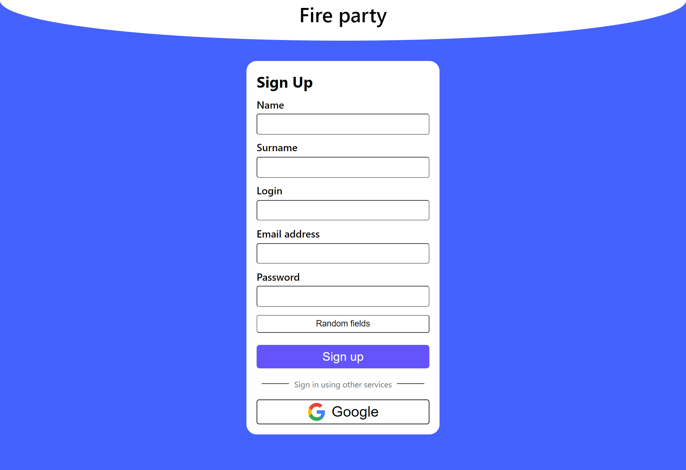
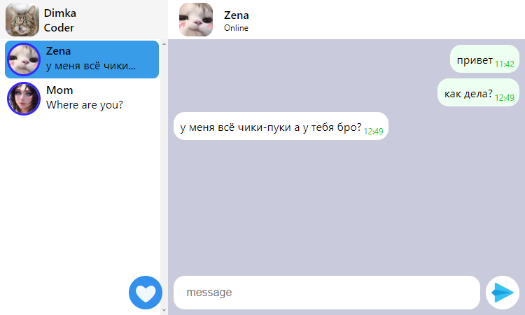
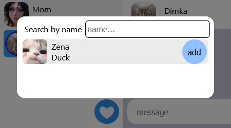
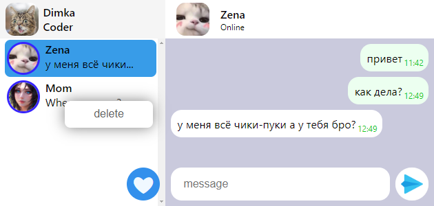
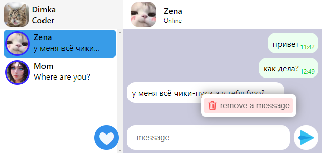
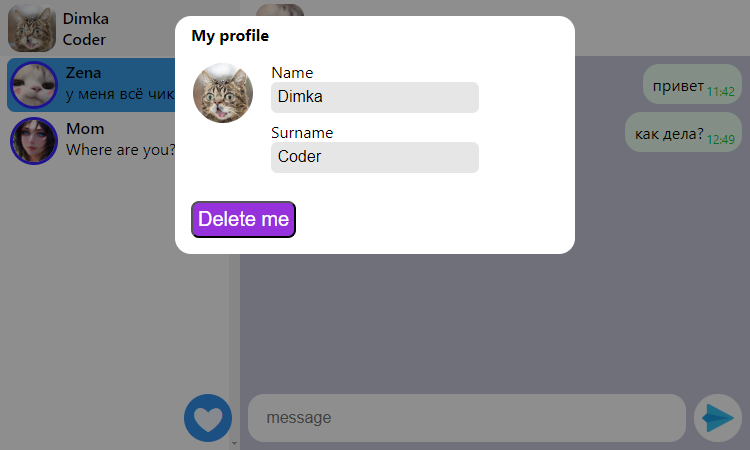
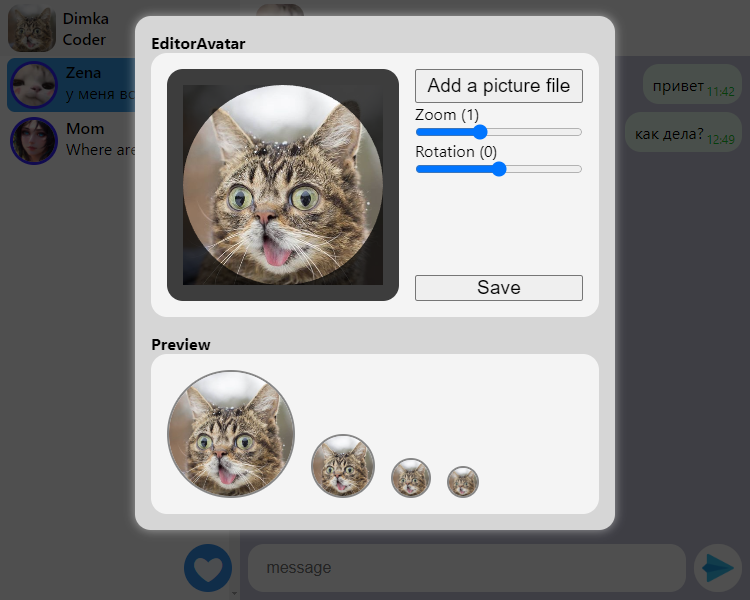

# Fire party
Этот пет проект был создан для демонстрации моих возможностей по создание web application с использованием WebSocket.
Приложение имеет возможности коммуницировать с другими пользователями и многое другое.

## Оглавление

0. [Возможности Fire party](#Возможности)
1. [Задачи](#Задачи)
2. [Список используемых технологий](#СписокТехнологий)
3. [Ссылки](#Ссылки)

## Возможности Fire party

1. Страница ригистрации
  

2. Главная страница (Communication)
  

3. Поиск друзей
  

4. Удалять чат
  

5. Удалять сообщение
  

6. Редактировать профиль
  

7. Редактировать аватар
  

## Задачи
- [x] Сделать красивую ригистрацию
- [x] Добавить сертификат безопасности SSL
- [x] Добавить чат панель
- [x] Отобразить в чате находится ли пользователь в сети
- [x] Добавить отправка сообщений
- [x] Добавить возможность удалить сообщение

## Список используемых технологий
1. React.JS
2. Nest.JS
3. PostgreSQL
4. Prisma.ORM
5. Socket.IO
