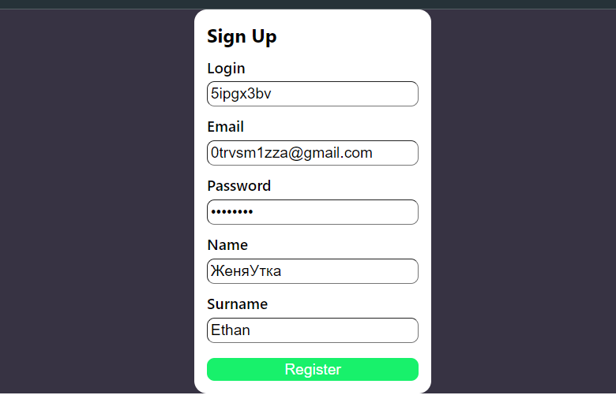

# Fire party
Этот пет проект был создан для демонстрации моих возможностей по создание web application

## Оглавление

0. [Возможности Fire party](#Возможности)
1. [Задачи](#Задачи)
2. [Список используемых технологий](#СписокТехнологий)
3. [Ссылки](#Ссылки)

## Возможности Fire party

1. Форма ригистрации

2. Главная страница (Communication)

## Задачи
- [x] Сделать красивую ригистрацию
- [ ] Добавить сертификат безопасности
- [x] Добавить чат панель

## Список используемых технологий
1. React.JS
2. PostgreSQL
3. PrismaORM

## Ссылки