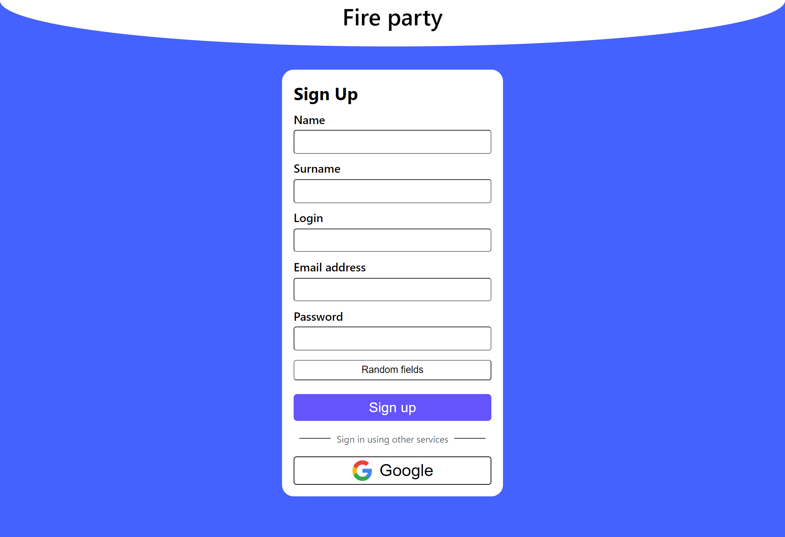

# Fire party
Этот пет проект был создан для демонстрации моих возможностей по создание web application с использованием WebSocket.
Приложение имеет возможности коммуницировать с другими пользователями и многое другое.

## Оглавление

0. [Возможности Fire party](#Возможности)
1. [Задачи](#Задачи)
2. [Список используемых технологий](#СписокТехнологий)
3. [Ссылки](#Ссылки)

## Возможности Fire party

1. Страница ригистрации

1. Главная страница (Communication)

## Задачи
- [x] Сделать красивую ригистрацию
- [ ] Добавить сертификат безопасности
- [x] Добавить чат панель
  - [x] Отобразить в чате находится ли пользователь в сети
  - [x] Добавить отправка сообщений
  - [x] Добавить возможность удалить сообщение

## Список используемых технологий
1. React.JS
2. Nest.JS
3. PostgreSQL
4. PrismaORM

## Ссылки